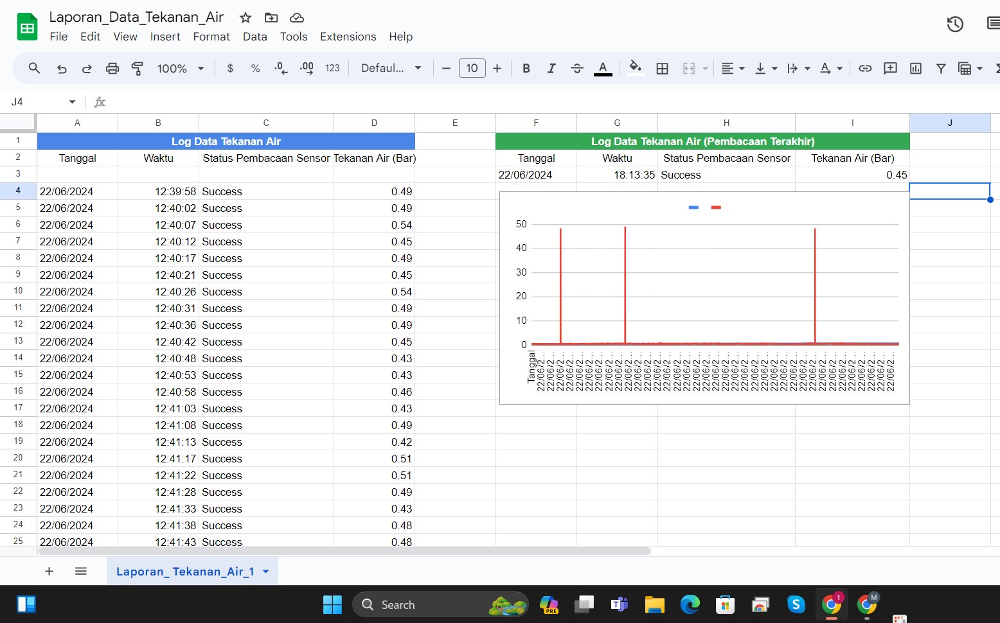

# pressureiotesp32toapps

# IoT Water Pressure Monitoring System

## 📌 Deskripsi
Prototipe sistem **IoT** untuk memantau tekanan air secara real-time.  
Menggunakan **Arduino** untuk membaca data dari **sensor water pressure**, mengirimkan data ke **ESP32**, lalu meneruskannya ke **Google Apps Script** untuk disimpan dan divisualisasikan di **Google Sheets**.

## 🔧 Teknologi yang Digunakan
- **Arduino UNO** → pembacaan data sensor tekanan air.
- **ESP32** → koneksi Wi-Fi dan pengiriman data ke cloud.
- **Water Pressure Sensor** (0–12 Bar) → pengukuran tekanan air.
- **Google Apps Script** → API endpoint untuk menerima data.
- **Google Sheets** → penyimpanan dan visualisasi data real-time.

## 🚀 Fitur
- Pengukuran tekanan air secara **real-time**.
- Penyimpanan data otomatis di Google Sheets.
- Dashboard monitoring sederhana di Google Sheets.
- Data logging untuk analisis tren.

## 📂 Arsitektur Sistem

## 📊 Contoh Tampilan

## ⚙️ Cara Kerja Singkat
1. Arduino membaca data analog dari sensor tekanan air.
2. Data dikirim ke ESP32 via serial.
3. ESP32 mengirim data ke Google Apps Script menggunakan HTTP POST.
4. Google Apps Script menyimpan data ke Google Sheets.
5. Google Sheets menampilkan grafik tekanan air secara otomatis.

## 📜 Lisensi
Proyek ini menggunakan lisensi **MIT**. Silakan gunakan dan modifikasi sesuai kebutuhan.

---

